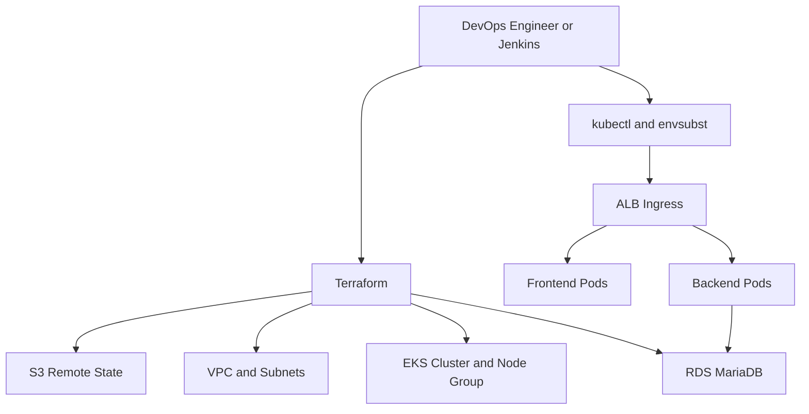

# Project Titan - EKS DevOps Platform

Project Titan is a cloud-native DevOps platform blueprint for running a three-tier application stack on AWS with Terraform, Amazon EKS, Docker, Jenkins, and Kubernetes manifests. The repository is structured for platform engineers and DevOps teams who want a practical reference implementation for Infrastructure as Code, containerized application delivery, and repeatable cluster deployment.

The current implementation provisions AWS foundation services with Terraform, deploys a MariaDB-backed application to EKS, and uses Jenkins to connect infrastructure provisioning with workload rollout. It is best understood as a production-minded baseline that can be hardened further for enterprise use.

## What This Repository Delivers

- Infrastructure as Code for AWS networking, EKS, RDS, and Terraform state storage
- Container build workflow for backend, frontend, and database images
- Kubernetes manifests for namespace, deployments, services, ingress, config, secret, and HPA
- CI/CD pipeline orchestration with Jenkins
- Local Docker Compose workflow for fast validation before cluster rollout

## Architecture



## Platform Stack

| Layer | Implementation |
| --- | --- |
| Cloud | AWS |
| IaC | Terraform |
| Container Runtime | Docker |
| Container Orchestration | Amazon EKS |
| CI/CD | Jenkins Pipeline |
| Database | Amazon RDS MariaDB |
| Remote State | Amazon S3 backend with lockfile |
| Traffic Entry | AWS ALB Ingress |
| Autoscaling | Kubernetes HPA |

## Repository Layout

```text
project-titan-eks-devops-platform/
|-- docker/
|   |-- compose.yaml
|   |-- backend.Dockerfile
|   |-- frontend.Dockerfile
|   |-- database.Dockerfile
|   `-- .env.example
|-- jenkins/
|   `-- Jenkinsfile
|-- k8s/
|   |-- namespace.yaml
|   |-- backend-*.yaml
|   |-- frontend-*.yaml
|   `-- ingress.yaml
|-- terraform/
|   |-- main.tf
|   |-- variables.tf
|   |-- outputs.tf
|   |-- backend.tf
|   |-- backend.hcl.example
|   |-- VARS/dev.tfvars
|   `-- module/
|       |-- s3_backend/
|       |-- vpc/
|       |-- eks/
|       `-- rds/
`-- README.md
```

## Deployment Model

Project Titan follows a standard platform delivery pattern:

1. Bootstrap Terraform state storage.
2. Provision AWS networking, EKS, and RDS with Terraform.
3. Build or reference application images.
4. Pull Terraform outputs into Kubernetes runtime configuration.
5. Apply Kubernetes manifests to EKS.
6. Expose frontend and backend through ALB ingress.

This design supports common platform engineering goals such as immutable infrastructure, declarative deployments, repeatable environment provisioning, and pipeline-driven delivery.

## Prerequisites

Make sure the operator workstation or Jenkins agent has:

- AWS CLI configured with permissions for VPC, EKS, EC2, IAM, S3, and RDS
- Terraform `>= 1.5`
- `kubectl`
- Docker
- A Bash-compatible shell with `envsubst`
- Optional but recommended: `helm`, for installing cluster add-ons

You also need:

- An AWS account and target region
- A registered DNS name if you want custom ingress hosts
- Docker Hub or another registry if you plan to use custom images

## Configuration Files You Should Review First

- [`terraform/backend.hcl.example`](terraform/backend.hcl.example)
- [`terraform/VARS/dev.tfvars`](terraform/VARS/dev.tfvars)
- [`docker/.env.example`](docker/.env.example)
- [`jenkins/Jenkinsfile`](jenkins/Jenkinsfile)

The `dev.tfvars` file currently defines the AWS region, CIDR ranges, database settings, node group sizing, and project name. Review and replace all sample values before deploying to a shared or production AWS account.

## Step 1: Bootstrap Terraform Remote State

This repository defines the S3 backend bucket inside Terraform itself. That means first-time deployment requires a one-time bootstrap using local state, followed by migration to the remote backend.

Run the following from the repository root:

```bash
terraform -chdir=terraform init -backend=false
terraform -chdir=terraform apply -target=module.s3_backend -var-file=VARS/dev.tfvars
terraform -chdir=terraform init -reconfigure -migrate-state -backend-config=backend.hcl.example
```

What this does:

- Creates the S3 bucket defined by `module.s3_backend`
- Keeps the first apply local only for backend bootstrap
- Migrates the local Terraform state into the S3 backend configured in `backend.hcl.example`

## Step 2: Provision AWS Infrastructure

After the backend is bootstrapped and migrated, provision the platform foundation:

```bash
terraform -chdir=terraform validate
terraform -chdir=terraform plan -var-file=VARS/dev.tfvars
terraform -chdir=terraform apply -var-file=VARS/dev.tfvars
```

The Terraform root module provisions:

- VPC with public, private, and database subnets
- Internet gateway and public route table
- EKS control plane and managed node group
- RDS MariaDB instance
- S3 bucket for Terraform state

Useful outputs:

```bash
terraform -chdir=terraform output
terraform -chdir=terraform output -raw eks_cluster_name
terraform -chdir=terraform output -raw aws_region
terraform -chdir=terraform output -raw rds_endpoint
terraform -chdir=terraform output -raw rds_port
terraform -chdir=terraform output -raw rds_db_name
terraform -chdir=terraform output -raw rds_username
terraform -chdir=terraform output -raw rds_password
```

## Step 3: Configure kubectl for the New Cluster

```bash
aws eks update-kubeconfig \
  --region "$(terraform -chdir=terraform output -raw aws_region)" \
  --name "$(terraform -chdir=terraform output -raw eks_cluster_name)"
```

Validate cluster access:

```bash
kubectl get nodes
```

## Step 4: Install Required EKS Add-ons

The Kubernetes manifests in this repository assume two cluster add-ons are available:

- AWS Load Balancer Controller, because [`k8s/ingress.yaml`](k8s/ingress.yaml) uses `ingress.class: alb`
- Metrics Server, because the backend and frontend HPAs depend on cluster metrics

Use the official installation guidance:

- AWS Load Balancer Controller: <https://docs.aws.amazon.com/eks/latest/userguide/lbc-helm.html>
- Metrics Server on EKS: <https://docs.aws.amazon.com/eks/latest/userguide/metrics-server.html>

At minimum, verify both are healthy before deploying workloads:

```bash
kubectl get deployment -n kube-system aws-load-balancer-controller
kubectl get deployment -n kube-system metrics-server
```

## Step 5: Build or Choose the Application Images

The Kubernetes deployment templates expect image references for both services:

- Backend image
- Frontend image

The provided Jenkins pipeline defaults to Docker Hub image references:

- `rushidholecom/rushi-backend:latest`
- `rushidholecom/rushi-frontend:v1`

If you want to build locally first:

```bash
docker build -f docker/backend.Dockerfile -t rushi-backend:latest docker
docker build -f docker/frontend.Dockerfile -t rushi-frontend:latest docker
```

Note that both Dockerfiles clone the application source from the EasyCRUD repository during build time.

## Step 6: Render and Apply Kubernetes Manifests

Export Terraform outputs and deployment variables:

```bash
export AWS_REGION="$(terraform -chdir=terraform output -raw aws_region)"
export EKS_CLUSTER_NAME="$(terraform -chdir=terraform output -raw eks_cluster_name)"
export RDS_ENDPOINT="$(terraform -chdir=terraform output -raw rds_endpoint)"
export RDS_PORT="$(terraform -chdir=terraform output -raw rds_port)"
export RDS_DB_NAME="$(terraform -chdir=terraform output -raw rds_db_name)"
export DB_USERNAME="$(terraform -chdir=terraform output -raw rds_username)"
export DB_PASSWORD="$(terraform -chdir=terraform output -raw rds_password)"

export BACKEND_IMAGE="rushidholecom/rushi-backend:latest"
export FRONTEND_IMAGE="rushidholecom/rushi-frontend:v1"
export APP_HOST="app.example.com"
export API_HOST="api.example.com"
```

Render the templated manifests:

```bash
rm -rf .rendered-k8s
mkdir -p .rendered-k8s

envsubst < k8s/backend-configmap.yaml > .rendered-k8s/backend-configmap.yaml
envsubst < k8s/backend-secret.yaml > .rendered-k8s/backend-secret.yaml
envsubst < k8s/backend-deployment.yaml > .rendered-k8s/backend-deployment.yaml
envsubst < k8s/frontend-deployment.yaml > .rendered-k8s/frontend-deployment.yaml
envsubst < k8s/ingress.yaml > .rendered-k8s/ingress.yaml
```

Apply the manifests:

```bash
kubectl apply -f k8s/namespace.yaml
kubectl apply -f .rendered-k8s/backend-configmap.yaml
kubectl apply -f .rendered-k8s/backend-secret.yaml
kubectl apply -f .rendered-k8s/backend-deployment.yaml
kubectl apply -f k8s/backend-service.yaml
kubectl apply -f k8s/backend-hpa.yaml
kubectl apply -f .rendered-k8s/frontend-deployment.yaml
kubectl apply -f k8s/frontend-service.yaml
kubectl apply -f k8s/frontend-hpa.yaml
kubectl apply -f .rendered-k8s/ingress.yaml
```

## Step 7: Verify the Rollout

```bash
kubectl get pods -n titan
kubectl rollout status deployment/titan-backend -n titan --timeout=10m
kubectl rollout status deployment/titan-frontend -n titan --timeout=5m
kubectl get svc -n titan
kubectl get ingress -n titan
kubectl get hpa -n titan
```

If rollout fails, these commands give the fastest signal:

```bash
kubectl describe pods -n titan
kubectl logs -n titan -l app.kubernetes.io/name=titan-backend --tail=100
kubectl logs -n titan -l app.kubernetes.io/name=titan-frontend --tail=100
```

## Jenkins Pipeline Flow

The Jenkins pipeline in [`jenkins/Jenkinsfile`](jenkins/Jenkinsfile) automates the same operational flow:

1. Checkout source
2. Verify toolchain
3. Run Terraform init, validate, and plan
4. Optionally run Terraform apply with approval gate
5. Read Terraform outputs
6. Render Kubernetes manifests with `envsubst`
7. Deploy to EKS
8. Validate backend and frontend rollouts

Pipeline parameters let you control:

- Whether Terraform apply runs
- The Terraform variable file
- Image tags and image references
- Public hostnames for ingress
- Rollout timeout and retry behavior

## Local Docker Workflow

For local validation without AWS:

```bash
cp docker/.env.example docker/.env
docker compose -f docker/compose.yaml up --build -d
```

If you are using PowerShell instead of Bash:

```powershell
Copy-Item docker/.env.example docker/.env
docker compose -f docker/compose.yaml up --build -d
```

Access the services locally:

- Frontend: `http://localhost:3000`
- Backend: `http://localhost:8080`
- MariaDB: `localhost:3306`

To stop the stack:

```bash
docker compose -f docker/compose.yaml down
```

## Operational Notes

- The backend application reads database configuration from Kubernetes `ConfigMap` and `Secret`.
- The frontend and backend each start with `2` replicas and have CPU-based HPA configuration.
- Ingress is currently HTTP on port `80`. For production, add TLS with ACM and ALB HTTPS annotations.
- The current Jenkins defaults use Docker Hub images, not Amazon ECR.
- The current implementation uses `use_lockfile = true` in the S3 backend configuration and does not define a DynamoDB lock table.

## Security and Hardening Recommendations

Before calling this production-ready in a regulated or shared environment, review and tighten these areas:

- Restrict the RDS security group instead of allowing `0.0.0.0/0` on port `3306`
- Move worker nodes to private subnets if you want a tighter network posture
- Replace plain example credentials in `dev.tfvars` and `.env.example`
- Add TLS termination and certificate management for ingress
- Store secrets in AWS Secrets Manager or External Secrets instead of static manifest rendering
- Add observability components explicitly if you need monitoring, alerting, and log aggregation

## Known Assumptions in This Repository

- EKS node groups are created from the public subnet outputs exposed by the VPC module
- RDS is deployed in the subnet group built from the private and database subnets
- The application images are built from the external EasyCRUD repository during Docker build time
- ALB controller and Metrics Server installation are external prerequisites and not provisioned by the Terraform code in this repository

## Summary

Project Titan gives a DevOps engineer a clear baseline for standing up a reusable AWS application platform with Terraform and EKS, then deploying workloads with Kubernetes manifests and Jenkins automation. The fastest successful path is: bootstrap the Terraform backend once, provision the AWS platform, install the required EKS add-ons, render manifests from Terraform outputs, and verify rollout through `kubectl`.
